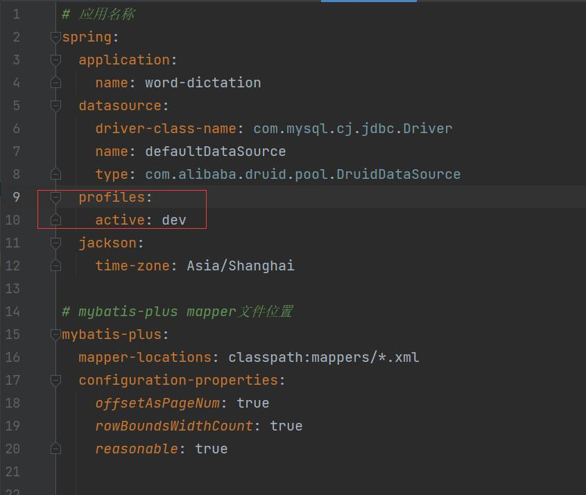
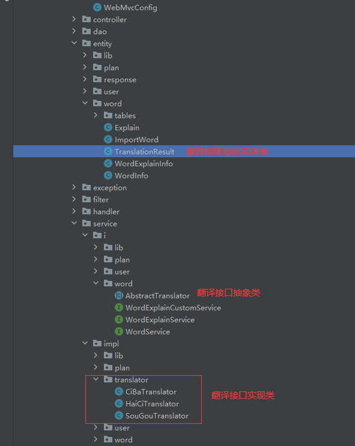
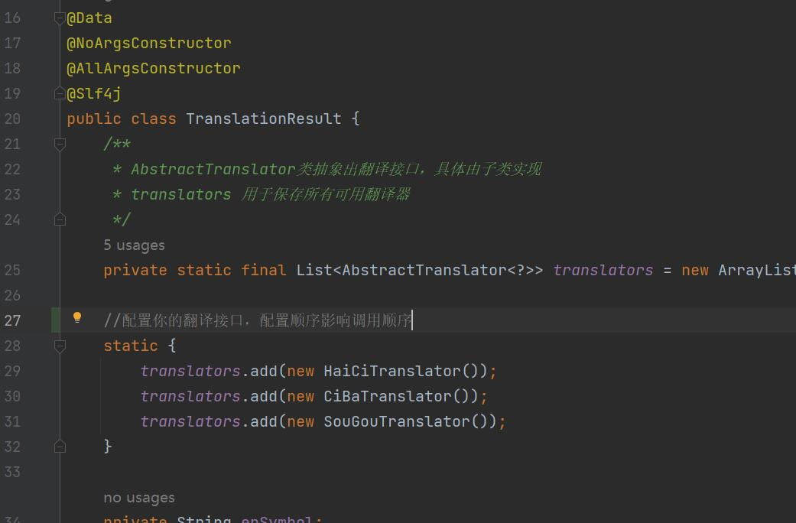

# 1.简介
自用，一个单词学习辅助网站，主要功能就是管理单词，然后可以抽选其中一部分单词出来生成默写格式，有中译英和英译中两种模式。单词的释义由后端自动获取，内置了几个翻译接口，支持扩展配置。

# 2.项目结构

JDK 版本：JDK1.8

项目基于前后端分离，但人不分离架构。

[前端看这](https://gitee.com/coclyun/word-dictation-vue)，后端就是 SpringBoot + MyBatisPlus 一把梭，登录的`token`以及注册的验证码存在redis里面。

在`application.yml` 中有一个`active`属性，用来控制启用哪个配文件，如果填`dev`就会启用`application-dev.yml`配置文件

注册和登录依赖邮件，需要自己在`application-dev.yml` 和 `application-pro.yml`中填入你自己的邮箱配置。

项目用到了七牛云，主要用于存储单词本封面图片，七牛云免费10g，自己申请后填入 `application-dev.yml` 和 `application-pro.yml`配置文件就可以了

其它的不多说了，很常规的三层架构，就写下翻译接口如何扩展：

如果需要自定义翻译接口，继承`AbstractTranslator`抽象类然后实现对应的方法，然后再在`TranslationResult`实体类中加入你的实现类：

注意：顺序影响调用顺序，后面可能换成注解方式配置，实际上默认的几个也够用了

